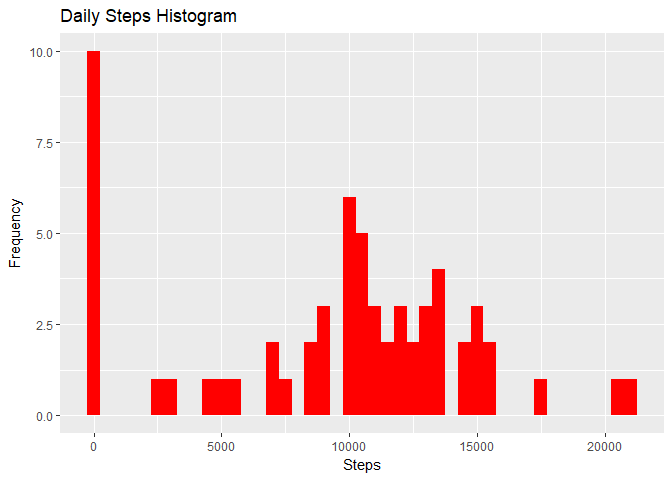
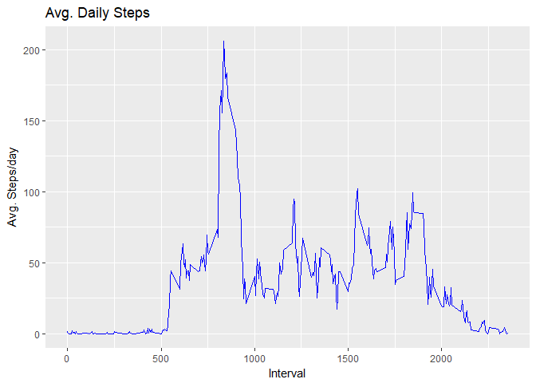
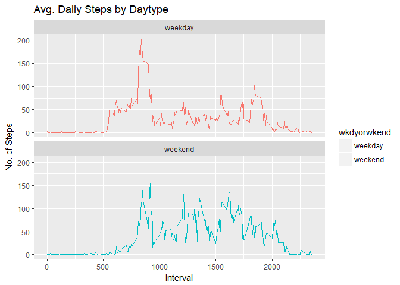

Loading and preprocessing the data
----------------------------------

Code is automated and set the current directory as working directory to download the required dataset

``` r
library(dplyr)
```

    ## 
    ## Attaching package: 'dplyr'

    ## The following objects are masked from 'package:stats':
    ## 
    ##     filter, lag

    ## The following objects are masked from 'package:base':
    ## 
    ##     intersect, setdiff, setequal, union

``` r
library(ggplot2)
URL <- "https://d396qusza40orc.cloudfront.net/repdata%2Fdata%2Factivity.zip"

if (!file.exists("F2activity.zip")){
    print("Download in progress")
    download.file(URL,destfile = "F2activity.zip")
    print("Download complete .....")
    print("File Unzip in progress .....")
    unzip("F2activity.zip")
    print("Unzip complete, file should reside in Working directory")
    print("reading file to dataframe")
    activityDf <- read.csv("activity.csv")
    print("Completed")
}else{
    print("reading file to dataframe")
    activityDf <- read.csv("activity.csv")
    print("Completed")
}
```

    ## [1] "reading file to dataframe"
    ## [1] "Completed"

What is mean total number of steps taken per day?
-------------------------------------------------

1.  Calculate the total number of steps taken per day

``` r
daily_steps <- activityDf %>% group_by(date)%>%summarise(steps =  sum(steps,na.rm = T))

head(daily_steps,10)
```

    ## # A tibble: 10 x 2
    ##    date       steps
    ##    <fct>      <int>
    ##  1 2012-10-01     0
    ##  2 2012-10-02   126
    ##  3 2012-10-03 11352
    ##  4 2012-10-04 12116
    ##  5 2012-10-05 13294
    ##  6 2012-10-06 15420
    ##  7 2012-10-07 11015
    ##  8 2012-10-08     0
    ##  9 2012-10-09 12811
    ## 10 2012-10-10  9900

1.  If you do not understand the difference between a histogram and a barplot, research the difference between them. Make a histogram of the total number of steps taken each day

``` r
act.Hist<-ggplot(daily_steps,aes(x=steps,fill="blue"))+geom_histogram(fill="red",binwidth=500)
act.Hist+labs(title="Daily Steps Histogram",x="Steps",y="Frequency")
```

 3. Calculate and report the mean and median of the total number of steps taken per day

``` r
mean_median <- daily_steps %>% summarise(Mean = mean(steps),Median = median(steps))
mean_median
```

    ## # A tibble: 1 x 2
    ##    Mean Median
    ##   <dbl>  <int>
    ## 1  9354  10395

What is the average daily activity pattern?
-------------------------------------------

1.  Make a time series plot (i.e. type = "l") of the 5-minute interval (x-axis) and the average number of steps taken, averaged across all days (y-axis)

``` r
IntervalDf <- activityDf%>%group_by(interval)%>%summarise(steps = mean(steps,na.rm=T))


ggplot(IntervalDf,aes(x=interval,y=steps))+geom_line(color="blue")+labs(title = "Avg. Daily Steps", x = "Interval", y = "Avg. Steps/day")
```



1.  Which 5-minute interval, on average across all the days in the dataset, contains the maximum number of steps?

``` r
IntervalDf %>% filter(steps == max(steps))
```

    ## # A tibble: 1 x 2
    ##   interval steps
    ##      <int> <dbl>
    ## 1      835   206

Imputing missing values
-----------------------

Note that there are a number of days/intervals where there are missing values (coded as NA). The presence of missing days may introduce bias into some calculations or summaries of the data. 1. Calculate and report the total number of missing values in the dataset (i.e. the total number of rows with NAs)

``` r
table(is.na(activityDf$steps))
```

    ## 
    ## FALSE  TRUE 
    ## 15264  2304

1.  Devise a strategy for filling in all of the missing values in the dataset. The strategy does not need to be sophisticated. For example, you could use the mean/median for that day, or the mean for that 5-minute interval, etc.

Our strategy will be to impute the missing values with the mean of the steps which is being calculated as below

``` r
meant <- median(activityDf$steps,na.rm = T)
```

1.  Create a new dataset that is equal to the original dataset but with the missing data filled in.

``` r
Tidy.activityDf <- activityDf
Tidy.activityDf[is.na(Tidy.activityDf$steps),"steps"] <- meant
```

1.  Make a histogram of the total number of steps taken each day and Calculate and report the mean and median total number of steps taken per day. Do these values differ from the estimates from the first part of the assignment? What is the impact of imputing missing data on the estimates of the total daily number of steps?

``` r
Tdaily_steps <- Tidy.activityDf %>% group_by(date)%>%summarise(steps =  sum(steps,na.rm = T))

act.Hist<-ggplot(Tdaily_steps,aes(x=steps,fill="blue"))+geom_histogram(fill="red",binwidth=500)

act.Hist+labs(title="Daily Steps Histogram",x="Steps",y="Frequency")
```


``` r
mean.median <- daily_steps%>%summarise(Mean = mean(steps),Median = median(steps))%>%mutate(DS= "Actual DS")

tidy.mean.median <- Tdaily_steps%>%summarise(Mean = mean(steps),Median = median(steps)) %>% mutate (DS = "Tidy DS")

all_mean.median <- rbind(mean.median,tidy.mean.median)

head(all_mean.median)
```

    ## # A tibble: 2 x 3
    ##    Mean Median DS       
    ##   <dbl>  <dbl> <chr>    
    ## 1  9354  10395 Actual DS
    ## 2  9354  10395 Tidy DS

| Type of Estimate             | Mean\_Steps | Median\_Steps |
|------------------------------|-------------|---------------|
| First Part (before imputing) | 14000.00    | 11458         |
| Second Part (after imputing) | 9354.23     | 10395         |

Are there differences in activity patterns between weekdays and weekends?
-------------------------------------------------------------------------

For this part the weekdays() function may be of some help here. Use the dataset with the filled-in missing values for this part.

1.  Create a new factor variable in the dataset with two levels -- "weekday" and "weekend" indicating whether a given date is a weekday or weekend day.

``` r
#converts column date of required type
Tidy.activityDf$date <- as.Date(Tidy.activityDf$date,format="%Y-%m-%d")
Tidy.activityDf$dayofweek <- weekdays(x=Tidy.activityDf$date)
Tidy.activityDf[grepl(pattern = "Monday|Tuesday|Wednesday|Thursday|Friday", x = Tidy.activityDf$dayofweek), "wkdyorwkend"] <- "weekday"


Tidy.activityDf[grepl(pattern = "Saturday|Sunday", x = Tidy.activityDf$dayofweek), "wkdyorwkend"] <- "weekend"

head(Tidy.activityDf,3)
```

    ##   steps       date interval dayofweek wkdyorwkend
    ## 1     0 2012-10-01        0    Monday     weekday
    ## 2     0 2012-10-01        5    Monday     weekday
    ## 3     0 2012-10-01       10    Monday     weekday

1.  Make a panel plot containing a time series plot (i.e. type = "l") of the 5-minute interval (x-axis) and the average number of steps taken, averaged across all weekday days or weekend days (y-axis). The plot should look something like the following, which was created using simulated data:

``` r
c1 <- Tidy.activityDf%>%group_by(wkdyorwkend,interval)%>%summarise(avgsteps = mean(steps))

ggplot(c1, aes(x = interval , y = avgsteps, color=wkdyorwkend)) + geom_line() + labs(title = "Avg. Daily Steps by Daytype", x = "Interval", y = "No. of Steps") + facet_wrap(~c1$wkdyorwkend , ncol = 1, nrow=2)
```


